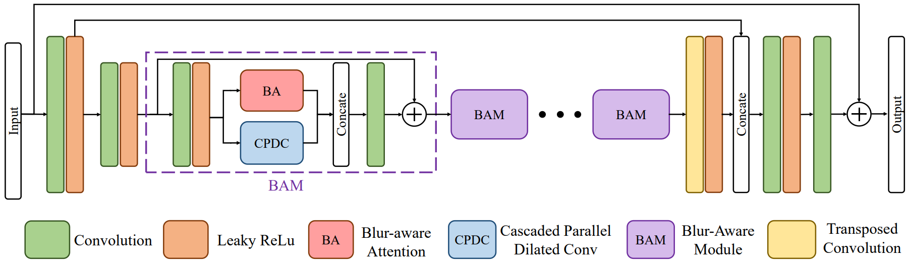

# BANet
Pytorch Implementation of "[BANet: Blur-aware Attention Networks for Dynamic Scene Deblurring](https://arxiv.org/abs/2101.07518)"


</br>



## Installation
```
git clone https://github.com/pp00704831/BANet.git
cd BANet
Conda create -n banet python=3.6
source activate banet
conda install pytorch==1.6.0 torchvision==0.7.0 cudatoolkit=10.1 -c pytorch
pip install opencv-python tqdm pyyaml joblib glog scikit-image tensorboardX albumentations==1.0.0
```

### **Training**
Download GoPro dataset into './datasets' </br>
For example: 
'./datasets/GoPro/train/blur/\*\*/\*.png'

**For training, run following commands.**
```
python train.py
```
### **Testing**
Download the GoPro trained model into './checkpoints'

**For testing on GoPro dataset**
```
python predict_BANet_GoPro_test_results.py --weights_path ./checkpoints/BANet_GoPro.pth 
```
**For testing on HIDE dataset**
```
python predict_BANet_HIDE_test_results.py --weights_path ./checkpoints/BANet_GoPro.pth 
```
### **Evaluation**
**For evaluation on GoPro results in MATLAB**
```
evaluation_GoPro.m
```
**For evaluation on HIDE results in MATLAB**
```
evaluation_HIDE.m
```
